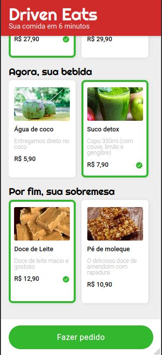

Bem-vindo ao DrivenEats! Meu primeiro projeto com JavaScript. Este é um site mobile de delivery de comida. Monte seu combo (prato, bebida e sobremesa) e envie o pedido para o WhatsApp do restaurante.

O site foi desenvolvido utilizando as linguagens de marcação HTML, estilização CSS e programação JavaScript.

Este projeto foi criado durante a formação Full Stack da Driven, onde aprendi a desenvolver aplicativos e páginas web completas, do front-end ao back-end. Bon appétit!